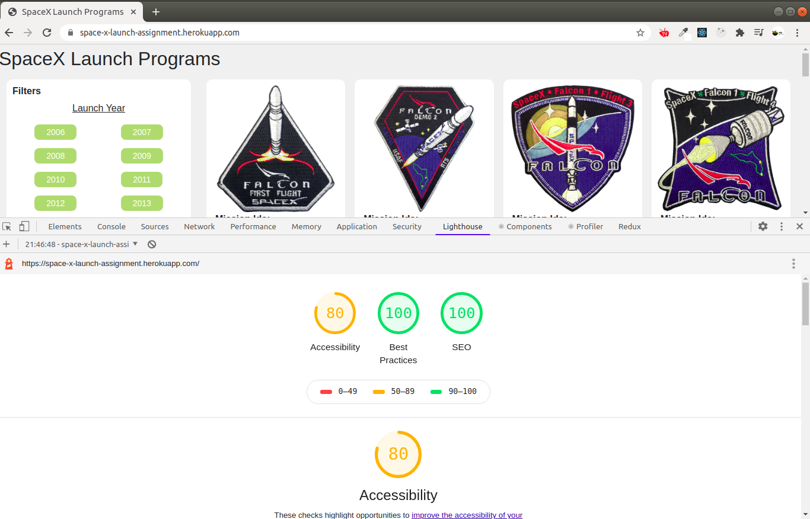

# spaceXprogram
Assignment project

###### To run this project in in local

git clone https://github.com/sudheerec107/spaceXprogram.git

npm i next -g

npm i

npm run dev

Now you can access wesite in local at: http://localhost:3000

First Rendering page indes.js

Filter component is to show only filter part.

Program component is used to render item based on input.

When ever user clicks on filter route will be changed with query params

# Light House Score Screen Shot
